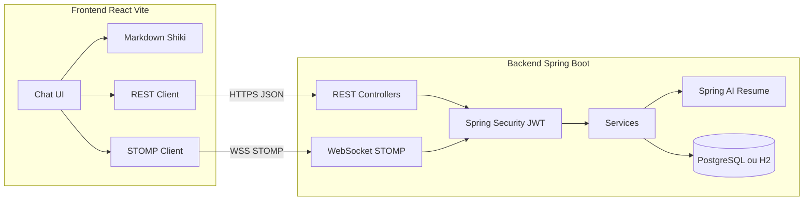

# CommHQ — Cahier des charges (Thème 13 · Hackathon J.U.I.N 2026)

**Projet :** CommHQ — Le Messager Technique Sécurisé  
**Édition :** Cursor · MVP 24 h  
**Stack :** Spring Boot 3 (backend) + React/Vite (frontend)  
**Équipe :** dev full-stack répartie — **vous : frontend**

---

## 1. Contexte et objectif

### 1.1 Thème hackathon

CommHQ est le **thème 13** du Hackathon J.U.I.N 2026 (catégorie Communication, Infrastructure & DevTools).

> Une application de chat d'entreprise organisée par **canaux thématiques**, intégrant nativement un rendu propre des **blocs de code**, de la **coloration syntaxique** et du **Markdown**.

**Bonus IA (+3 pts max) :** un bot de canal capable de **résumer en trois phrases clés** les discussions d'un groupe, pour que les managers rattrapent rapidement les décisions.

### 1.2 Objectif MVP

Livrer en 24 h une démo **convaincante et fonctionnelle** :

- Connexion utilisateur sécurisée
- Navigation par canaux thématiques
- Envoi / réception de messages en temps quasi réel
- Rendu Markdown + code (coloration syntaxique) dans le fil de discussion
- Bouton « Résumer le canal » alimenté par l'IA (bonus jury)

### 1.3 Principe d'organisation équipe

| Domaine | Responsable | Stack |
|--------|-------------|-------|
| API REST, auth, persistance, WebSocket, bot IA | Backend | Spring Boot 3, Spring Security, Spring Data JPA, PostgreSQL/H2 |
| UI chat, rendu Markdown, UX, intégration API | **Frontend (vous)** | React 18, Vite, TypeScript, Tailwind, Shiki |
| Contrat d'interface | **Les deux** | OpenAPI (`openapi.yaml`) + événements WebSocket documentés |

**Règle d'or :** le contrat API est figé **dès H+2**. Le frontend avance avec des mocks si le backend n'est pas prêt.

---

## 2. Vision produit

CommHQ cible les **équipes techniques** (dev, data, infra) qui échangent du code, des logs et de la doc dans Slack/Teams sans rendu adapté.

**Proposition de valeur :**

- Canaux par sujet (`#backend`, `#incident-prod`, `#data-pipeline`)
- Messages riches : titres, listes, liens, blocs ` ```lang ` avec coloration
- Accès contrôlé (canaux publics / privés)
- Résumé IA à la demande pour les managers

**Personas démo :**

1. **Dev** — poste un snippet Python/SQL avec coloration
2. **Lead** — lit le fil, clique « Résumer » et obtient 3 phrases actionnables
3. **Admin** — crée un canal privé `#security-review`

---

## 3. Périmètre fonctionnel

### 3.1 Must-have (MVP)

| ID | Fonctionnalité | Frontend | Backend |
|----|----------------|----------|---------|
| F01 | Inscription / connexion (email + mot de passe) | Pages login/register, stockage token JWT | Spring Security, JWT, endpoints auth |
| F02 | Liste des canaux + création | Sidebar canaux, modal création | CRUD canaux, membership |
| F03 | Fil de messages d'un canal | Zone messages scrollable, composer | GET messages paginés, POST message |
| F04 | Temps réel | Abonnement WebSocket, append message | STOMP `/topic/channels/{id}` |
| F05 | Rendu Markdown | `react-markdown` + GFM | Stocke le Markdown brut |
| F06 | Coloration syntaxique | Shiki (ou Prism) sur blocs code | — |
| F07 | Indicateur auteur + horodatage | Avatar initiales, heure relative | Champs `author`, `createdAt` |
| F08 | Résumer le canal (IA) | Bouton + panneau résultat | Spring AI → 3 phrases |

### 3.2 Should-have (si marge de temps)

| ID | Fonctionnalité |
|----|----------------|
| F09 | Canaux privés + invitation |
| F10 | Recherche simple dans le canal courant |
| F11 | Indicateur « en ligne » / typing |
| F12 | Mode sombre |

### 3.3 Won't-have (hors scope 24 h)

- Chiffrement E2E
- Threads, réactions, mentions @
- Upload fichiers / pièces jointes
- Application mobile native
- SSO LDAP / OAuth entreprise

---

## 4. Architecture technique



### 4.1 Structure monorepo recommandée

```
CommHQ/
├── Documentation/
├── backend/                 # Équipe backend
│   ├── src/main/java/...
│   ├── src/main/resources/
│   └── pom.xml
├── frontend/                # Votre périmètre
│   ├── src/
│   │   ├── api/
│   │   ├── components/
│   │   ├── hooks/
│   │   ├── pages/
│   │   ├── stores/
│   │   └── types/
│   ├── openapi.yaml         # Contrat partagé (source de vérité)
│   └── package.json
└── docker-compose.yml       # Postgres + backend + frontend (optionnel)
```

### 4.2 Stack frontend (détaillée)

| Couche | Choix | Justification hackathon |
|--------|-------|-------------------------|
| Framework | React 18 + Vite | HMR rapide, excellent support Cursor |
| Langage | TypeScript strict | Types alignés sur OpenAPI |
| Style | Tailwind CSS + shadcn/ui | UI pro en peu de temps |
| Routing | React Router v6 | Login, chat, layout |
| État serveur | TanStack Query | Cache messages, invalidation |
| État local | Zustand (léger) | Token JWT, canal actif |
| Markdown | `react-markdown` + `remark-gfm` | GFM : tableaux, listes, code |
| Syntaxe | Shiki | Coloration fidèle VS Code |
| WebSocket | `@stomp/stompjs` + SockJS | Compatible Spring STOMP |
| HTTP | Axios ou fetch + intercepteur JWT | Standard |
| Tests | Vitest + Testing Library (optionnel) | 1–2 tests composant clés |

### 4.3 Stack backend (référence équipe)

| Couche | Choix |
|--------|-------|
| Runtime | Java 21, Spring Boot 3.3+ |
| Sécurité | Spring Security 6, JWT (jjwt ou spring-security-oauth2-resource-server) |
| API | Spring Web MVC, validation Bean Validation |
| Temps réel | Spring WebSocket + STOMP |
| Persistance | Spring Data JPA, PostgreSQL (prod démo) / H2 (dev) |
| IA | Spring AI (OpenAI ou autre provider configuré par env) |
| Doc API | springdoc-openapi → `/v3/api-docs` |

---

## 5. Contrat d'interface (API)

> **Document de référence :** `frontend/openapi.yaml` (à créer en H+1, validé à H+2).

### 5.1 Modèle de données

```typescript
// Types partagés (frontend/src/types/index.ts)

interface User {
  id: string;
  email: string;
  displayName: string;
}

interface Channel {
  id: string;
  name: string;           // slug : "backend", sans #
  description?: string;
  isPrivate: boolean;
  createdAt: string;      // ISO 8601
}

interface Message {
  id: string;
  channelId: string;
  author: User;
  content: string;        // Markdown brut
  createdAt: string;
}

interface ChannelSummary {
  channelId: string;
  summary: string;        // 3 phrases max
  messageCount: number;
  generatedAt: string;
}
```

### 5.2 Endpoints REST

| Méthode | Route | Auth | Description |
|---------|-------|------|-------------|
| POST | `/api/auth/register` | Non | `{ email, password, displayName }` → `{ token, user }` |
| POST | `/api/auth/login` | Non | `{ email, password }` → `{ token, user }` |
| GET | `/api/channels` | JWT | Liste des canaux accessibles |
| POST | `/api/channels` | JWT | `{ name, description?, isPrivate? }` → `Channel` |
| GET | `/api/channels/{id}/messages` | JWT | Query : `?page=0&size=50` → `{ content: Message[], total }` |
| POST | `/api/channels/{id}/messages` | JWT | `{ content }` → `Message` + broadcast WS |
| POST | `/api/channels/{id}/summarize` | JWT | → `ChannelSummary` (appel IA) |

**Headers communs :** `Authorization: Bearer <jwt>`

### 5.3 WebSocket STOMP

| Élément | Valeur |
|---------|--------|
| Endpoint | `ws://localhost:8080/ws` (SockJS fallback) |
| Subscribe | `/topic/channels/{channelId}` |
| Payload entrant | `{ type: "MESSAGE_CREATED", payload: Message }` |
| Auth | Header STOMP `Authorization: Bearer <jwt>` ou cookie selon implé backend |

**Comportement frontend :**

1. Connexion STOMP après login
2. Subscribe au canal actif à chaque changement de canal
3. À réception `MESSAGE_CREATED` : append si absent du cache (éviter doublons avec POST response)

### 5.4 Règles Markdown (contenu message)

- Autorisé : GFM (titres, gras, italique, listes, liens, tableaux, blocs code)
- Blocs code : fence ` ```lang ... ``` ` — `lang` passé à Shiki
- Sanitisation : `rehype-sanitize` côté frontend (pas de `<script>`)
- Longueur max message : **4000 caractères** (afficher compteur dans composer)

---

## 6. Spécifications frontend (votre périmètre)

### 6.1 Pages et navigation

| Route | Page | État auth |
|-------|------|-----------|
| `/login` | Formulaire connexion | Public |
| `/register` | Formulaire inscription | Public |
| `/` | Redirect → `/channels/general` ou premier canal | Privé |
| `/channels/:channelId` | Layout chat principal | Privé |

**Layout chat (`AppLayout`) :**

```
┌─────────────────────────────────────────────────────┐
│ Header : CommHQ logo | user | déconnexion           │
├──────────────┬──────────────────────────────────────┤
│ Sidebar      │ Fil messages (scroll inverse ou bas) │
│ - canaux     │                                      │
│ - + nouveau  │ Composer Markdown (textarea + send)  │
│              │ [Résumer le canal]                   │
└──────────────┴──────────────────────────────────────┘
```

### 6.2 Composants clés

| Composant | Responsabilité |
|-----------|----------------|
| `ChannelSidebar` | Liste canaux, canal actif surligné, bouton créer |
| `MessageList` | Virtualisation si >100 msgs (optionnel), auto-scroll bas |
| `MessageItem` | Avatar, nom, date, corps rendu |
| `MarkdownRenderer` | GFM + blocs code → Shiki |
| `CodeBlock` | Shiki HTML, bouton copier |
| `MessageComposer` | Textarea, Ctrl+Enter envoi, preview toggle (should-have) |
| `SummarizePanel` | Loading, 3 phrases, erreur API |
| `AuthGuard` | Redirect si pas de token |
| `CreateChannelModal` | Formulaire nom + description |

### 6.3 Rendu Markdown — exigences qualité

**Exemple message démo obligatoire :**

````markdown
## Incident API

Erreur observée :

```json
{ "status": 502, "service": "payment-api" }
```

Actions :
- [ ] Rollback v2.3.1
- [x] Alerte #oncall
````

**Critères visuels :**

- Police monospace pour code, taille lisible
- Contraste suffisant (WCAG AA minimum sur texte)
- Bloc code : fond distinct, bordure, label langue optionnel
- Liens : ouvrir nouvel onglet + `rel="noopener"`

### 6.4 Gestion d'état

```typescript
// authStore (Zustand)
{ token, user, setAuth, logout }

// TanStack Query keys
['channels']
['messages', channelId, page]
['summary', channelId]  // stale après nouveau message
```

**Flux envoi message :**

1. Optimistic UI (optionnel) ou spinner bouton Send
2. POST `/api/channels/{id}/messages`
3. TanStack Query invalidate `['messages', channelId]`
4. Message aussi reçu via WS (dédoublonner par `message.id`)

### 6.5 Variables d'environnement frontend

```env
VITE_API_BASE_URL=http://localhost:8080
VITE_WS_URL=http://localhost:8080/ws
```

### 6.6 Mode mock (développement autonome)

Tant que le backend n'est pas prêt, utiliser **MSW (Mock Service Worker)** :

- `frontend/src/mocks/handlers.ts` — réponses auth, canaux, messages
- `frontend/src/mocks/browser.ts` — activé si `VITE_USE_MOCKS=true`

Jeux de données mock minimal :

- 3 canaux : `general`, `backend`, `incidents`
- 10 messages dont 2 avec blocs code JSON et Python
- Utilisateur : `dev@commhq.local`

---

## 7. Spécifications backend (référence — équipe)

### 7.1 Entités JPA

- `User` (id, email, passwordHash, displayName)
- `Channel` (id, name, description, isPrivate)
- `ChannelMember` (userId, channelId, role)
- `Message` (id, channelId, authorId, content, createdAt)

### 7.2 Sécurité

- Mots de passe : BCrypt
- JWT expiration : 24 h (hackathon)
- CORS : autoriser `http://localhost:5173` (Vite dev)
- Endpoints `/api/**` protégés sauf auth

### 7.3 Bot résumé (Spring AI)

**Endpoint :** `POST /api/channels/{id}/summarize`

**Prompt système (backend) :**

> Tu es un assistant pour équipes techniques. Résume la conversation suivante en **exactement 3 phrases courtes**, en français, orientées décisions et actions. Pas de bullet points. Pas d'intro.

**Entrée :** N derniers messages du canal (max 50 ou 8000 tokens)

**Sortie JSON :** `{ "summary": "...", "messageCount": N, "generatedAt": "..." }`

---

## 8. Critères d'acceptation (Definition of Done)

### 8.1 Démo jury (checklist)

- [ ] Un utilisateur se connecte
- [ ] Il voit au moins 2 canaux et bascule entre eux
- [ ] Il envoie un message Markdown avec bloc code coloré
- [ ] Un second client (ou onglet) reçoit le message sans refresh
- [ ] Le bouton « Résumer le canal » affiche 3 phrases cohérentes
- [ ] L'UI est propre, responsive desktop (1280px)

### 8.2 Critères frontend spécifiques

- [ ] Token JWT persisté (localStorage) + déconnexion
- [ ] Erreurs API affichées (toast ou banner)
- [ ] Loading states sur liste messages et résumé
- [ ] Pas de XSS via Markdown (sanitize actif)
- [ ] Build production `npm run build` sans erreur

---

## 9. Planning 24 h (suggestion équipe)

| Heure | Backend | Frontend (vous) |
|-------|---------|-----------------|
| H+0 → H+1 | Init Spring Boot, entités, H2 | Init Vite + Tailwind + routing + layout vide |
| H+1 → H+2 | Auth JWT, OpenAPI draft | OpenAPI validé, MSW mocks, pages auth |
| H+2 → H+6 | CRUD canaux + messages REST | Sidebar, message list, composer, intégration REST |
| H+6 → H+10 | WebSocket STOMP | Client STOMP, temps réel, dédoublonnage |
| H+10 → H+14 | Spring AI summarize | MarkdownRenderer + Shiki, bouton résumé |
| H+14 → H+18 | CORS, polish API, Postgres | UX polish, erreurs, responsive |
| H+18 → H+22 | Bugfix intégration | Bugfix intégration, scénario démo |
| H+22 → H+24 | Déploiement backend | Déploiement frontend (Vercel/Netlify/static) |

---

## 10. Stratégie bonus IA (jury)

Pour maximiser les **+3 points** :

1. **Implémentation concrète** : bouton visible « Résumer le canal », pas seulement une slide
2. **Utilité démo** : canal pré-rempli avec discussion technique réaliste → résumé actionnable
3. **Stack crédible** : Spring AI côté backend + mention dans le pitch
4. **Fallback** : si API IA down, message clair + résumé statique de secours (optionnel)

---

## 11. Risques et mitigations

| Risque | Mitigation |
|--------|------------|
| Backend en retard | MSW + contrat OpenAPI figé H+2 |
| WebSocket complexe | Fallback polling 5 s en dernier recours |
| Shiki lent | Lazy load langages (`json`, `python`, `java`, `sql` seulement) |
| CORS / JWT WS | Pair programming 30 min à H+10 backend ↔ frontend |
| IA lente | Skeleton loader + timeout 15 s |

---

## 12. Livrables attendus

| Livrable | Responsable |
|----------|-------------|
| Repo Git monorepo | Tous |
| `openapi.yaml` | Backend lead, revu frontend |
| App frontend déployée (URL) | **Vous** |
| App backend déployée ou JAR + docker | Backend |
| Script / données seed démo | Backend |
| Pitch 3 min (dont démo live) | Tous |

---

## 13. Références

- [Guide Officiel Hackathon J.U.I.N 2026](./Guide%20Officiel%20du%20Hackathon%20J.U.I.N%202026%20-%20%C3%89dition%20Cursor%20V2.pdf) — Thème 13, bonus IA, workflow Cursor
- [Prompt Cursor frontend](./Prompt.md) — prompts prêts à l'emploi
- Spring AI : https://docs.spring.io/spring-ai/reference/
- Shiki : https://shiki.style/

---

*Document v1.0 — CommHQ · Spring Boot + React · Frontend owner : équipe dev*
